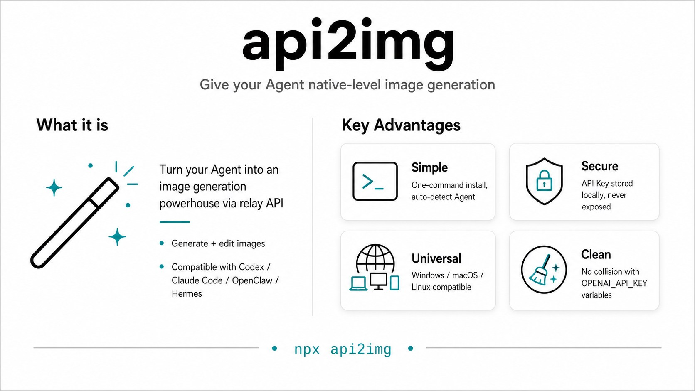

# Api2img Skill

[中文](README.md) | [English](README.en.md)

## Features

`Give any agent using a non-official API key near-native image generation capability.`

api2img is designed for people who use agents through a relay API and also need image generation and image editing.

Supports installable agents such as `Codex`, `Claude Code`, `OpenClaw`, and `Hermes`, and is also compatible with other agents that can be connected manually.



## Installation

Method 1 (recommended for beginners): copy the following command to your agent:

```powershell
Please help me install the skill: npx api2img
```

Method 2: install from the command line

```powershell
npx api2img
```

## Recommended Image API Relay Provider

[https://cc-vibe.com](https://cc-vibe.com/register?aff=7LBQWRFY5ETG)

Built by a friend, low price with volume:

- Personal request data is deleted every day, privacy-friendly
- Supports image generation (1k image = RMB 0.01 each, 2k image = RMB 0.02 each, 4k image = RMB 0.03 each)
- Supports both Claude Code and Codex (RMB 8.8 = USD 100 API quota, very low price, model verification supported)

---

## Usage

It will be automatically called by the agent when needed, and you can also use it for regular image generation, for example:

- [Generate] Generate an xxx image
- [Edit] Replace a specific part of the image
- [Upload] Modify xxx in the image I uploaded

## Supported Commands

Tell the agent in natural language:

```powershell
Installation:
- Install api2img as a global skill (default)
- Install api2img into the current project

Configuration:
- Help me configure the base url for api2img
- Help me update the api key for api2img
- Help me clear the configuration of api2img
```

## Privacy Statement

- This skill itself does not proactively upload your other local data, and you can also ask the Agent to perform a security review first.
- When generating images, the uploaded images and prompts will be sent to the third-party relay provider you configured. Please avoid processing ID documents, faces, work secrets, or other private and sensitive content whenever possible.
